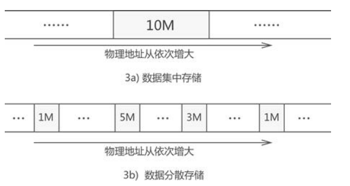

#### 数据的逻辑结构和存储结构（物理结构）

数据的存储方式可分为`线性表`、`树`和`图`三种存储结构，而每种存储结构又可细分为`顺序存储结构`和`链式存储结构`。数据存储方式如此之多，针对不同类型的数据选择合适的存储方式是至关重要的。

数据存储结构的选择取决于两方面，即数据的`逻辑结构`和`存储结构`（又称物理结构）。

#### 逻辑结构

###### 数据的逻辑结构，简单地理解，就是指的数据之间的逻辑关系.

父子、兄弟等这些关系都指的是数据间的逻辑关系，假设我们要存储这样一张家庭成员关系图，不仅要存储张平、张华等数据，还要存储它们之间的关系，两者缺一不可。

一组数据成功存储到计算机的衡量标准是要能将其完整的复原。例如图所示的成员关系图，如果所存储的数据能将此成员关系图彻底复原，则说明数据存储成功.

通过学习数据结构，我们可以学到 3 种存储结构分别存储这 3 类逻辑关系的数据，换句话说：

1. ###### 线性表用于存储具有“一对一”逻辑关系的数据；
2. ###### 树结构用于存储具有“一对多”关系的数据；
3. ###### 图结构用于存储具有“多对多”关系的数据；

由此，我们可以通过分析数据之间的逻辑关系来决定使用哪种存储结构，但具体使用顺序存储还是链式存储，还要通过数据的物理结构来决定。

#### 存储结构（物理结构）

数据的存储结构，也就是物理结构，指的是数据在物理存储空间上选择集中存放还是分散存放。假设要存储大小为 10G 的数据，则集中存放就如图 a) 所示，分散存放就如图 b）所示

如果选择集中存储，就使用`顺序存储结构`；反之，就使用`链式存储`。至于如何选择，主要取决于存储设备的状态以及数据的用途。

我们知道，集中存储（底层实现使用的是数组）需要使用一大块连续的物理空间，假设要存储大小为 1G 的数据，若存储设备上没有整块大小超过 1G 的空间，就无法使用顺序存储，此时就要选择链式存储，因为链式存储是`随机存储数据`，占用的都是
存储设备中比较小的存储空间，因此有一定几率可以存储成功。

并且，数据的用途不同，选择的存储结构也不同。将数据进行集中存储有利于后期对数据进行`遍历操作`，而分散存储更有利于后期`增加或删除数据`。因此，如果后期需要对数据进行大量的检索（遍历），就选择集中存储；反之，若后期需要对数据做进一步更新（增加或删除），则选择分散存储。
